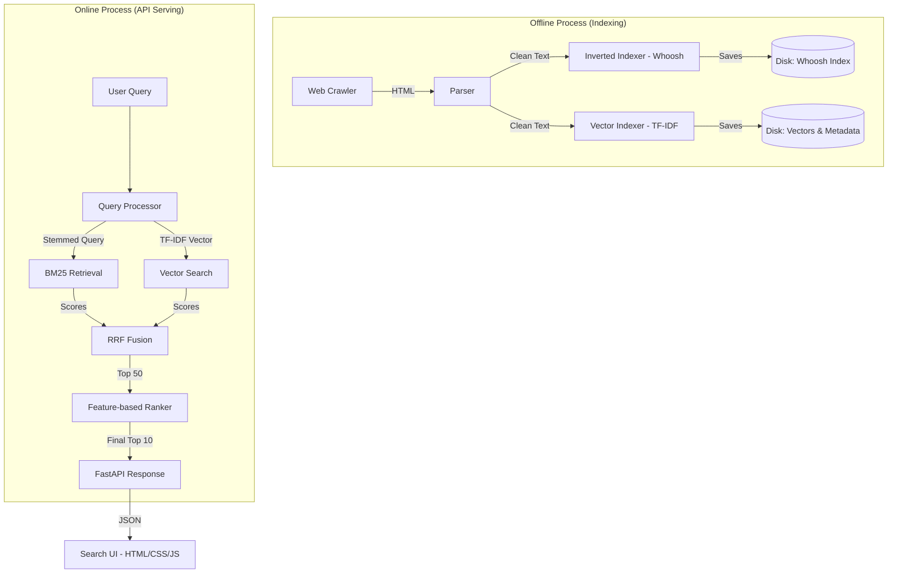

# Search Engine Architecture

This document outlines the technical design and data flow of the Antigravity Search Engine.

## 🏗️ High-Level Component Diagram

## 🔍 Detailed Component Breakdown

### 1. Crawling & Parsing (`crawler.py`)
- **Strategy**: Recursive Breadth-First Search (BFS) starting from seed URLs.
- **Parsing**: Uses `BeautifulSoup4` to extract clean text while removing noise like `<script>` and `<style>` tags.
- **Safety**: Implements domain restriction (stays within the seed site) and simple rate limiting.

### 2. Multi-Stage Indexing (`indexer.py`)
- **Stage 1 (Inverted Index)**: Uses `Whoosh` to create a schema-based index. This is optimized for exact keyword matching and BM25 scoring.
- **Stage 2 (Vector Index)**: Uses `Scikit-Learn`'s `TfidfVectorizer`. This converts documents into high-dimensional vectors, enabling similarity-based retrieval even when exact keywords don't match.

### 3. Retrieval Pipeline (`retrieval.py`)
- **Hybrid Search**: Executes both BM25 and Vector Search in parallel.
- **Reciprocal Rank Fusion (RRF)**: Merges the results from both retrieval methods using the RRF algorithm. 
  - Formula: `Score = 1 / (60 + rank)`
- **Benefit**: Combines the precision of keyword search with the recall of semantic similarity.

### 4. Ranking Framework (`ranker.py`)
- **Signal Extraction**: Calculates additional features for the retrieved candidates:
  - **Title Match**: Boolean or count of query words in the title.
  - **Exact Phrase Match**: Checks if the query appears precisely in the content.
  - **Length Penalty**: Prefers concisely informative pages over extremely long or short ones.
- **Scoring**: Applies a weighted sum of these features to produce the final `rank_score`.

### 5. Serving Layer (`app.py`)
- **Asynchronous API**: Built with `FastAPI` for high-performance request handling.
- **Caching**: Implements a simple in-memory cache for hot queries to ensure sub-millisecond responses for recurring searches.
- **UI Interaction**: Serves `index.html` as the primary entry point.

---
[Return to README](README.md)
